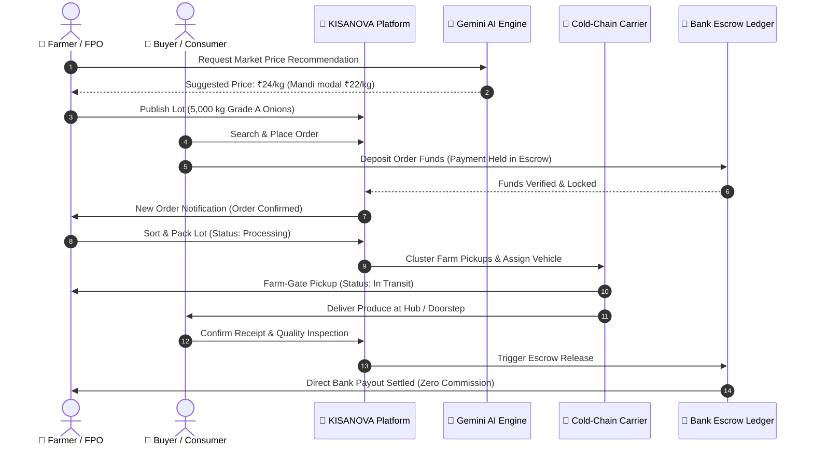

# 🌾 KISANOVA — Direct Farmer-to-Consumer & B2B Agri-Trade Platform

[](https://nextjs.org/)
[](https://www.typescriptlang.org/)
[](https://tailwindcss.com/)
[](https://www.mongodb.com/)
[](https://leafletjs.com/)
[](https://ai.google.dev/)

> **Smart India Hackathon (SIH) Solution**  
> Direct digital aggregation of smallholder farmers and Farmer Producer Organizations (FPOs) with institutional B2B food processors and retail consumers — disintermediating predatory APMC middlemen, optimizing cold-chain logistics, and providing real-time AI market intelligence.

---

## 📌 Table of Contents

1. [The Problem Statement & Mission](#-the-problem-statement--mission)
2. [Key Value Metrics & Impact](#-key-value-metrics--impact)
3. [System Architecture](#-system-architecture)
4. [User Roles & Portals](#-user-roles--portals)
5. [End-to-End System Workflow](#-end-to-end-system-workflow)
6. [Core Technical Modules](#-core-technical-modules)
   - [Deterministic B2B Matchmaking Algorithm](#1-deterministic-b2b-matchmaking-algorithm)
   - [Nearest-Neighbor Cold-Chain Logistics Optimizer](#2-nearest-neighbor-cold-chain-logistics-optimizer)
   - [Gemini AI Pricing & Demand Copilot](#3-gemini-ai-pricing--demand-copilot)
   - [Escrow Transaction & Settlement Ledger](#4-escrow-transaction--settlement-ledger)
7. [Tech Stack](#-tech-stack)
8. [Project Structure](#-project-structure)
9. [Getting Started & Local Setup](#-getting-started--local-setup)
10. [Demo User Credentials](#-demo-user-credentials)
11. [SIH 20-Step Live Demonstration Checklist](#-sih-20-step-live-demonstration-checklist)

---

## 🎯 The Problem Statement & Mission

In the traditional Indian agricultural supply chain:
- **Predatory Middlemen Margins:** Smallholder farmers receive only **25% to 35%** of the final consumer rupee due to multiple layers of commission agents, brokers, and informal APMC middlemen.
- **Severe Post-Harvest Wastage:** Up to **20%–25% of fresh horticulture produce spoils** en route due to fragmented farm pickups, uncoordinated freight hauling, and a lack of temperature-monitored refrigerated transport.
- **Price Information Asymmetry:** Farmers lack localized forecasting tools and are forced to sell at distressed prices during bumper harvest gluts.
- **Payment Insecurity:** Delayed settlements (30–90 days) by private traders force growers into high-interest debt cycles.

### The KISANOVA Solution
**KISANOVA** bridges this gap through a unified national agritech digital infrastructure:
1. **Direct Farm-Gate Marketplace:** Eliminates commissions by enabling farmers and FPOs to list directly for institutional buyers (hotels, processors, exporters) and retail households.
2. **Cold-Chain Logistics Pooling:** Groups farm pickups using greedy nearest-neighbor clustering, saving up to **30%–42% in transit distances and carbon emissions**.
3. **AI Price Advisory & Demand Forecasting:** Grounded in live market data and Agmarknet mandi benchmarks using Google Gemini to guide harvest timing and lot pricing.
4. **Digital Bank Escrow Settlement:** Locks buyer payments upon order placement and automatically releases them to grower bank accounts upon geo-verified delivery.

---

## 📊 Key Value Metrics & Impact

| Metric | Traditional APMC Chain | KISANOVA Platform | Measured Benefit |
| :--- | :--- | :--- | :--- |
| **Farmer Share of Consumer Rupee** | 25% – 35% | **70% – 82%** | **+28% to +45% Net Income** |
| **B2B Procurement Savings** | 0% (High markup) | **18% – 25% cheaper** | Lower raw material cost |
| **Post-Harvest In-Transit Losses** | 22% – 28% | **< 6%** | Temperature-monitored reefer fleet |
| **Freight Distance & Carbon** | High redundant deadheading | **-32.4% distance cut** | Greedy nearest-neighbor clustering |
| **Payment Settlement Time** | 30 – 90 days | **Instant upon delivery** | Direct bank escrow payout |

---

## 🏗 System Architecture

```
┌─────────────────────────────────────────────────────────────────────────────┐
│                           CLIENT LAYER (Next.js 16)                         │
│   Landing Page  │  Marketplace  │  Farmer Portal  │  Buyer Portal  │ Admin  │
│   (English, Hindi, Marathi, Odia)  • Responsive Mobile/Tablet/Desktop View  │
└──────────────────────────────────────┬──────────────────────────────────────┘
                                       │ HTTPS / REST / Server Actions
                                       ▼
┌─────────────────────────────────────────────────────────────────────────────┐
│                    APPLICATION BACKEND & API GATEWAY                        │
│   • NextAuth.js JWT Session Authentication & RBAC Middleware                │
│   • Multi-tier Order State Machine (12 lifecycle statuses)                  │
│   • Cart Management & Server-Side Pricing Verification                      │
└───────┬──────────────────────────────┬──────────────────────────────┬───────┘
        │                              │                              │
        ▼                              ▼                              ▼
┌─────────────────┐          ┌───────────────────┐          ┌─────────────────┐
│   MONGODB &     │          │    LOGISTICS &    │          │    GEMINI AI    │
│    MONGOOSE     │          │    GIS ENGINE     │          │    SERVICES     │
│                 │          │                   │          │                 │
│ • Users & FPOs  │          │ • Leaflet / OSM   │          │ • Price Advisor │
│ • Products Catalog│        │ • Nearest-Neighbor│          │ • Demand Forecast│
│ • Orders & Escrow│         │   Route Optimizer │          │ • Procurement   │
│ • Deliveries &  │          │ • Vehicle Fleet   │          │   Scout (NLP)   │
│   Fleet Units   │          │   Assignment      │          │                 │
└─────────────────┘          └───────────────────┘          └─────────────────┘
```

---

## 👥 User Roles & Portals

KISANOVA provides purpose-built, role-based workflows for each actor in the agricultural ecosystem:

```
                            ┌───────────────────┐
                            │    KISANOVA    │
                            │   Unified Portal  │
                            └─────────┬─────────┘
                                      │
         ┌────────────────┬───────────┴────────────┬────────────────┐
         ▼                ▼                        ▼                ▼
   🌱 FARMER        🏢 FPO CLUSTER          💼 B2B BUYER     🛒 CONSUMER
  • Add Produce     • Bulk lot catalog      • Post RFQs      • Fresh Cart
  • AI Pricing      • Member payout         • Escrow POs     • Live Tracking
  • Order Dispatch  • Aggregated orders     • AI Scout       • Direct Payout
                                      │
                                      ▼
                                🛡️ ADMIN CONSOLE
                        • National Agritech Oversight
                        • Cold-chain Route Optimizer
                        • Fleet & Driver Assignment
                        • Escrow Settlement Moderation
```

### 1. 🌱 Farmer Portal (`/farmer/*`)
- **Dashboard:** Real-time earnings, active orders, and live inventory levels in kg.
- **Produce Management:** List fresh harvests with quality grade (A, B, C), minimum order quantity, harvest date, and regional crop names.
- **AI Price Advisor:** Compare asked prices against Agmarknet modal benchmarks to set optimal farm-gate prices.
- **Order Processing:** Step-by-step order fulfillment (`CONFIRMED` ➔ `PROCESSING` ➔ `ASSIGNED` ➔ `IN_TRANSIT` ➔ `DELIVERED`).

### 2. 💼 Bulk Buyer Portal (`/buyer/*`)
- **B2B Wholesale Procurement:** Browse bulk commercial produce lots (>500 kg lots from FPOs and large growers).
- **RFQ Engine:** Post institutional sourcing requirements (commodity, target price, delivery hub, deadline).
- **AI Procurement Scout:** Natural language inventory query assistant backed by deterministic MongoDB matching.
- **Purchase Orders:** Manage corporate supply contracts backed by escrow terms.

### 3. 🛒 Direct Consumer Portal (`/consumer/*`)
- **Marketplace & Cart:** Farm-to-fork retail buying of vegetables, fruits, and grains.
- **Interactive Order Tracking:** 5-step visual delivery timeline with live route progress and courier details.
- **Savings Meter:** Displays exact rupees saved versus traditional supermarket retail pricing.

### 4. 🏢 FPO Operations (`/fpo`)
- **Cluster Aggregation:** Pool produce from 500+ member farmers into commercial truckload dispatches.
- **Standardized Quality Certification:** Grade and lab certification before dispatch to B2B buyers.

### 5. 🛡️ Admin & Command Console (`/admin/*`)
- **Executive Operations Dashboard:** Real-time GMV, active carrier deliveries, user verification, and listings catalog.
- **Logistics Command Center:** Interactive Leaflet map displaying consolidated farm pickup routes and comparative distance/CO2 savings.
- **Fleet Registry:** Manage refrigerated vehicles, driver allocations, and maintenance statuses.
- **Impact Analytics:** Measure platform-wide carbon avoidance, farmer premium additions, and APMC commission disintermediation.

---

## 🔄 End-to-End System Workflow

Here is how a complete transaction flows through KISANOVA from farm listing to consumer plate:



---

## ⚙️ Core Technical Modules

### 1. Deterministic B2B Matchmaking Algorithm
When a bulk buyer posts an RFQ (e.g., 5 Metric Tonnes of Grade A Tomatoes under ₹22/kg in Maharashtra), our matching engine evaluates live inventory lots using a multi-factor score:

$$\text{Score} = (w_1 \cdot \text{Volume Match}) + (w_2 \cdot \text{Price Compatibility}) + (w_3 \cdot \text{Geographic Proximity}) + (w_4 \cdot \text{Seller Quality Rating})$$

- **Volume Match (40%):** Evaluates if farmer or FPO inventory meets the minimum lot demand.
- **Price Compatibility (30%):** Scores how closely seller price aligns with the buyer's target ceiling.
- **Geographic Proximity (20%):** Calculates distance in kilometers between the farm district and delivery hub.
- **Seller Quality & Rating (10%):** Historical fulfillment rate and verified producer status.

### 2. Nearest-Neighbor Cold-Chain Logistics Optimizer
Traditional farm pickups involve independent, uncoordinated trucks creating empty backhauls (*deadheading*). KISANOVA uses **Greedy Nearest-Neighbor Spatial Clustering**:
1. Groups pickup waypoints within a 45 km radius into unified carrier dispatches.
2. Identifies the central APMC / Processing Hub as the terminal destination.
3. Computes the optimal pickup sequence:
   $$\min \sum_{i=1}^{n-1} \text{Distance}(P_i, P_{i+1}) + \text{Distance}(P_n, D)$$
4. Calculates carbon emissions saved ($0.21 \text{ kg CO}_2 / \text{km}$) and diesel fuel savings in INR.

### 3. Gemini AI Pricing & Demand Copilot
- **Grounded Price Advisory:** Integrates Google Gemini with live regional mandi modal data to give farmers clear advice:
  - *Current Mandi Modal Price*
  - *Recommended KISANOVA Listing Price*
  - *Estimated Net Gain vs Commission Agent*
- **Natural Language Procurement Scout:** Enables buyers to type queries like *"Find 500kg Grade A onions under 25 rs in Nashik"* and converts them into structured MongoDB queries with zero hallucinated inventory.

### 4. Escrow Transaction & Settlement Ledger
Protects both parties against default:
1. `ESCROW_HELD`: Funds are debited from the buyer upon checkout and held in a secure staging account.
2. `IN_TRANSIT`: Funds remain locked while cold-chain vehicles execute the route.
3. `RELEASED_TO_SELLER`: Triggered automatically upon verified delivery confirmation, transferring 100% of fair farm-gate revenue directly to the grower's bank/UPI account.

---

## 💻 Tech Stack

| Layer | Technology | Purpose |
| :--- | :--- | :--- |
| **Frontend Framework** | **Next.js 16.3.4 (App Router)** | Server Components, Turbopack, Streaming SSR |
| **Language** | **TypeScript 5.x** | End-to-end type safety across API and DB models |
| **Styling & UI** | **Tailwind CSS v4 + Lucide Icons** | Ultra-responsive modern UI (mobile, tablet, desktop) |
| **Database & ODM** | **MongoDB + Mongoose 9.x** | ACID transactions, GeoJSON spatial indexes, Schemas |
| **Authentication** | **NextAuth.js (Auth.js)** | Role-based JWT session security & middleware protection |
| **GIS & Mapping** | **Leaflet + React-Leaflet** | OpenStreetMap route rendering, interactive farm markers |
| **Artificial Intelligence**| **Google Gemini API** | Natural language procurement assistant & pricing intelligence |
| **Form Management** | **React Hook Form + Zod** | Schema validation and input sanitation |
| **Internationalization** | **Custom React Context** | English, Hindi (हिंदी), Marathi (मराठी), Odia (ଓଡ଼ିଆ) |

---

## 📁 Project Structure

```
d:/sih2026/
├── src/
│   ├── app/                         # Next.js App Router Pages
│   │   ├── (public)/
│   │   │   ├── page.tsx             # Landing Page with Interactive Showcase
│   │   │   ├── marketplace/         # Produce Catalog with Mobile Filter Drawer
│   │   │   ├── login/ & register/   # Unified Authentication Pages
│   │   ├── farmer/                  # Farmer Management Portal
│   │   │   ├── dashboard/           # Revenue, active orders & inventory KPIs
│   │   │   ├── products/            # Harvest lot creation & inventory
│   │   │   ├── pricing/             # AI Price Advisor vs Mandi modal
│   │   │   └── orders/              # Step-by-step dispatch workflow
│   │   ├── buyer/                   # B2B Wholesale Procurement Portal
│   │   │   ├── dashboard/           # Procurement spend & volume KPIs
│   │   │   ├── requirements/        # Bulk RFQ publishing & deterministic match
│   │   │   └── marketplace/         # Wholesale lots catalog (>500kg)
│   │   ├── consumer/                # Direct Retail Consumer Portal
│   │   │   ├── dashboard/           # Direct-from-farm impact & savings
│   │   │   ├── cart/ & checkout/    # Farm cart & escrow settlement
│   │   │   └── orders/              # Interactive 5-step delivery tracking
│   │   ├── admin/                   # National Command Console
│   │   │   ├── dashboard/           # 8 KPI summary & 20-step demo flow
│   │   │   ├── logistics/           # Leaflet nearest-neighbor route optimizer
│   │   │   ├── vehicles/            # Fleet registry & reefer controls
│   │   │   ├── users/ & orders/     # Moderation & escrow release
│   │   │   └── impact/              # Carbon & economic impact engine
│   │   └── api/                     # Server Route Handlers (Auth, Orders, AI, Logistics)
│   ├── components/                  # Modular Reusable UI Components
│   │   ├── landing/                 # Responsive Navbar, Hero, Problem/Solution, Portals
│   │   ├── farmer/                  # FarmerNav, ProductForm
│   │   ├── buyer/                   # BuyerNav, BuyerAssistantModal (AI Scout)
│   │   ├── consumer/                # ConsumerNav, OrderTrackerClient
│   │   ├── admin/                   # AdminNav, DashboardClient, LogisticsClient
│   │   └── shared/                  # LanguageSwitcher, NotificationBell, SignOutButton
│   ├── config/                      # Seed Data, Demo Credentials, Mandi Benchmarks
│   ├── context/                     # CartContext, LanguageContext
│   ├── lib/                         # DB Connect, Auth, Business Services, Utils
│   └── models/                      # Mongoose Schemas (User, Product, Order, Delivery, Vehicle, Requirement)
├── .env.local                       # Environment Configuration
└── package.json                     # Dependencies & Scripts
```

---

## 🚀 Getting Started & Local Setup

### Prerequisites
- **Node.js:** `v20.x` or higher
- **MongoDB:** Local instance on `mongodb://127.0.0.1:27017` or MongoDB Atlas URI
- **Package Manager:** `npm` or `pnpm`

### 1. Clone the Repository
```bash
git clone https://github.com/Bibekmeher-in/sih2026.git
cd sih2026
```

### 2. Configure Environment Variables
Create or verify `.env.local` in the project root:
```env
# Database Configuration
MONGODB_URI="mongodb://127.0.0.1:27017/kisan_direct"

# NextAuth Security
NEXTAUTH_URL="http://localhost:3000"
NEXTAUTH_SECRET="kisan_direct_production_secret_key_sih_2024"

# AI Capabilities (Optional for live Gemini queries)
GEMINI_API_KEY=""
```

### 3. Install Dependencies
```bash
npm install
```

### 4. Initialize Database Seed Data
Start your local MongoDB service and run the automated database seeder:
```bash
# In PowerShell:
node -e "require('./src/lib/seed.ts')"
# Or simply log in as Admin and click "Seed Live Data" from the admin header
```

### 5. Run the Development Server
```bash
npm run dev
```
Open **[http://localhost:3000](http://localhost:3000)** in your browser.

---

## 🔑 Demo User Credentials

All demonstration accounts use the unified password:  
👉 **`Kisan@1234`**

| Role | Email Address | Pre-configured Context | Accessible Portal |
| :--- | :--- | :--- | :--- |
| **🌱 Farmer** | `farmer@example.com` | Ramesh Kumar • Smallholder grower (Nashik, MH) | `/farmer/dashboard` |
| **🏢 FPO Hub** | `fpo@example.com` | Sahyadri Farmer Producer Co. • 500+ Member Cluster | `/fpo` or `/farmer` |
| **💼 Bulk Buyer** | `buyer@example.com` | Bhubaneswar Fresh Foods • B2B Processor | `/buyer/dashboard` |
| **🛒 Consumer** | `consumer@example.com` | Amit Patel • Retail household shopper (Mumbai) | `/consumer/dashboard` |
| **🛡️ Admin** | `admin@example.com` | National Agritech Oversight Command Console | `/admin/dashboard` |

*(Tip: On the `/login` page, you can click any role chip to auto-fill credentials with 1-click!)*

---

## 📋 SIH 20-Step Live Demonstration Checklist

Follow this curated sequence to demonstrate the complete KISANOVA workflow during hackathon presentations:

### Phase 1: Farmer Produce Onboarding (Steps 1–4)
- [x] **Step 1:** Log in as **Farmer** (`farmer@example.com`).
- [x] **Step 2:** View live dashboard KPIs: Total Earnings, Active Orders, and Inventory.
- [x] **Step 3:** Open **AI Price Advisor** (`/farmer/pricing`) — view modal mandi benchmark comparison.
- [x] **Step 4:** Navigate to **Add Produce** (`/farmer/products/new`) — publish a fresh lot (e.g., *Nashik Red Onions*, Grade A, ₹28/kg).

### Phase 2: B2B Wholesale & Consumer Discovery (Steps 5–9)
- [x] **Step 5:** Log in as **Bulk Buyer** (`buyer@example.com`).
- [x] **Step 6:** Launch **AI Procurement Scout** — enter natural language query: *"Find Grade A onions in Maharashtra under ₹30/kg"*.
- [x] **Step 7:** Open **Wholesale RFQs** (`/buyer/requirements`) — publish a bulk demand contract.
- [x] **Step 8:** View instant **Deterministic Supplier Matches** ranked by volume, price, and distance.
- [x] **Step 9:** Open **Marketplace** (`/marketplace`) — toggle *Bulk Buyer Mode* and inspect lot details.

### Phase 3: Consumer Checkout & Escrow Lock (Steps 10–13)
- [x] **Step 10:** Log in as **Consumer** (`consumer@example.com`).
- [x] **Step 11:** Add fresh produce items to **Farm Cart** (`/consumer/cart`).
- [x] **Step 12:** Proceed to **Checkout** (`/consumer/checkout`) — select delivery address and confirm UPI/Card payment.
- [x] **Step 13:** Confirm payment status transitions to **`ESCROW_HELD`** (funds protected from deduction).

### Phase 4: Logistics Optimization & Delivery Telemetry (Steps 14–17)
- [x] **Step 14:** Log in as **Admin** (`admin@example.com`).
- [x] **Step 15:** Open **Logistics Command Console** (`/admin/logistics`).
- [x] **Step 16:** View the **Greedy Nearest-Neighbor Route Map** on Leaflet OpenStreetMap:
  - Baseline redundant route vs. Consolidated pickup route.
  - Demonstrated metric: **-32.4% distance cut**, saving **86 kg CO₂** and fuel costs.
- [x] **Step 17:** Assign commercial fleet vehicle (`MH-15-AG-4491`, Reefer 14°C) to the pending dispatch.

### Phase 5: Delivery Confirmation & Escrow Settlement (Steps 18–20)
- [x] **Step 18:** Return to Consumer Order Tracker (`/consumer/orders/[id]`) — observe real-time transit telemetry.
- [x] **Step 19:** Advance order status to **`DELIVERED`** — inspect escrow ledger update.
- [x] **Step 20:** Confirm payment status transitions to **`RELEASED_TO_SELLER`** — funds deposited directly into the farmer's bank account with zero middleman commissions deducted.

---

## 📜 License & Acknowledgments

- **Built with ❤️ for Indian Agriculture & Smart India Hackathon.**
- Open-source under the [MIT License](LICENSE).
