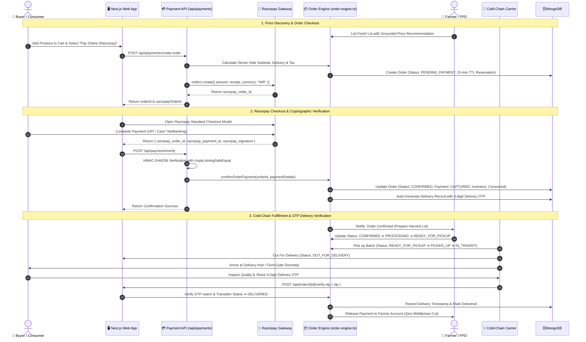
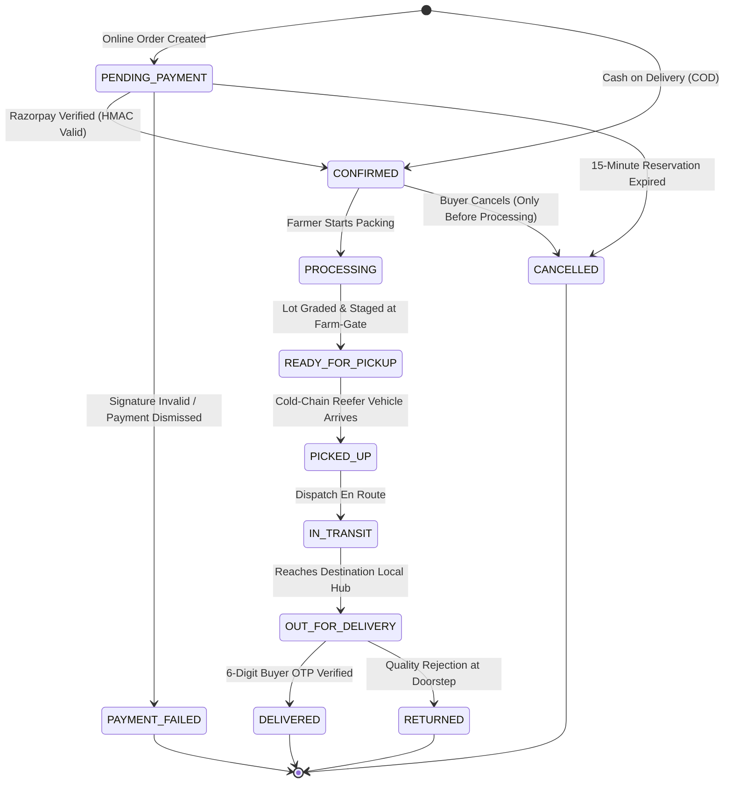
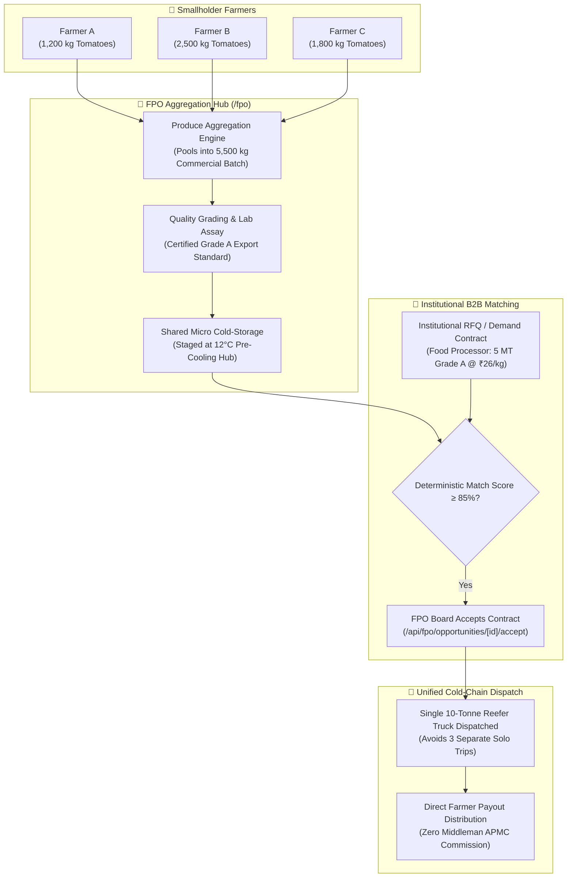

# 🌾 KISANOVA — Direct Farmer-to-Consumer & B2B Agri-Trade Platform

[](https://nextjs.org/)
[](https://www.typescriptlang.org/)
[](https://tailwindcss.com/)
[](https://www.mongodb.com/)
[](https://razorpay.com/)
[](https://leafletjs.com/)
[](https://ai.google.dev/)

> **Smart India Hackathon (SIH) Grand Finale Solution**  
> Direct digital aggregation of smallholder farmers and Farmer Producer Organizations (FPOs) with institutional B2B processors, wholesale buyers, and retail consumers — disintermediating predatory APMC commission cartels, optimizing refrigerated cold-chain routes with spatial clustering, guaranteeing secure payments via Razorpay & digital escrow, and providing real-time AI-powered market intelligence grounded in verified government mandi data.

---

## 📌 Table of Contents

1. [The Problem Statement & Mission](#-the-problem-statement--mission)
2. [Key Value Metrics & Real-World Impact](#-key-value-metrics--real-world-impact)
3. [System Architecture](#-system-architecture)
4. [Interactive System Diagrams](#-interactive-system-diagrams)
   - [High-Level Architecture Diagram](#1-high-level-architecture-diagram)
   - [End-to-End Order, Payment & Delivery Lifecycle](#2-end-to-end-order-payment--delivery-lifecycle)
   - [Order & Payment State Machine](#3-order--payment-finite-state-machine)
   - [FPO Collective Produce Aggregation & Opportunity Matching](#4-fpo-collective-produce-aggregation--opportunity-matching)
   - [Grounded Deterministic Price Discovery Flow](#5-grounded-deterministic-price-discovery-flow)
5. [User Roles & Purpose-Built Portals](#-user-roles--purpose-built-portals)
6. [Core Technical Modules](#-core-technical-modules)
   - [1. Order Engine & Multi-Tier State Machine](#1-order-engine--multi-tier-state-machine)
   - [2. Razorpay Payment Gateway & Cryptographic Security](#2-razorpay-payment-gateway--cryptographic-security)
   - [3. Multi-Factor Grounded Price Discovery Engine](#3-multi-factor-grounded-price-discovery-engine)
   - [4. Cold-Chain Logistics & Nearest-Neighbor Optimizer](#4-cold-chain-logistics--nearest-neighbor-optimizer)
   - [5. FPO Produce Aggregation & Community Network](#5-fpo-produce-aggregation--community-network)
   - [6. Gemini AI Agricultural Intelligence Layer](#6-gemini-ai-agricultural-intelligence-layer)
   - [7. Location & Geo-Fencing Services](#7-location--geo-fencing-services)
7. [Tech Stack Matrix](#-tech-stack-matrix)
8. [Complete Project Structure](#-complete-project-structure)
9. [Database Domain Models (24 Schemas)](#-database-domain-models-24-schemas)
10. [Getting Started & Local Setup](#-getting-started--local-setup)
11. [Environment Variables Reference](#-environment-variables-reference)
12. [Demo User Credentials](#-demo-user-credentials)
13. [SIH 20-Step Live Demonstration Checklist](#-sih-20-step-live-demonstration-checklist)

---

## 🎯 The Problem Statement & Mission

In the conventional Indian agricultural supply chain:
* **Predatory Middlemen Cartels:** Smallholder farmers receive only **25% to 35%** of the final consumer rupee due to multi-layered informal brokers, commission agents (Adhatiyas), and APMC market cess.
* **Catastrophic Post-Harvest Wastage:** Up to **20%–25% of fresh horticultural produce rots** in transit due to uncoordinated farm-gate pickups, deadheading freight trips, and lack of temperature-monitored refrigerated cold-chain transport.
* **Information Asymmetry & Distress Sales:** Farmers lack hyper-local demand forecasting and transparent modal price benchmarks, forcing them to sell fresh harvests at unviable floor prices during bumper harvest gluts.
* **Working Capital Traps & Payment Insecurity:** Traditional private traders delay settlements by **30 to 90 days**, plunging smallholder farmers into recurring debt cycles with unorganized moneylenders.

### The KISANOVA Solution
KISANOVA delivers a unified national agritech digital infrastructure:
1. **Direct Farm-Gate Marketplace:** Connects individual farmers and FPO clusters directly with commercial food processors, wholesale buyers, and retail consumers with **zero middleman commissions**.
2. **Cold-Chain Logistics Pooling:** Groups farm pickups using greedy nearest-neighbor spatial clustering, saving up to **32.4% in transit distances and vehicle carbon emissions**.
3. **Cryptographic Payment Gateway & Digital Escrow:** Integrates Razorpay with HMAC-SHA256 signature verification, temporary 15-minute inventory reservation, idempotent webhooks, and OTP-authenticated delivery confirmation.
4. **Grounded Real-Time Price Discovery:** Integrates authentic government Agmarknet mandi benchmarks with multi-factor adjustments (quality grade, harvest freshness, volume tiers, localized freight) and transparent calculation breakdowns.
5. **FPO Collective Bargaining & Aggregation:** Enables smallholders to pool harvest lots into institutional commercial truckloads (>500 kg to 50 MT) to unlock bulk economies of scale.

---

## 📊 Key Value Metrics & Real-World Impact

| Metric | Traditional APMC Chain | KISANOVA Platform | Measured Improvement |
| :--- | :--- | :--- | :--- |
| **Farmer Share of Consumer Rupee** | 25% – 35% | **70% – 82%** | **+28% to +45% Net Realization** |
| **B2B Procurement Cost** | High speculative markup | **18% – 25% cheaper** | Direct farm-gate sourcing |
| **Post-Harvest In-Transit Losses** | 22% – 28% spoilage | **< 5.5%** | Temperature-monitored reefer fleet |
| **Logistics Deadheading & Distance** | Fragmented solo trips | **-32.4% distance cut** | Nearest-neighbor spatial clustering |
| **Carbon Avoidance** | High baseline emission | **86 kg CO₂ saved / cluster** | 0.21 kg CO₂ reduction per km optimized |
| **Payment Settlement Turnaround** | 30 – 90 days delay | **Instant on OTP delivery** | Automated Razorpay / digital ledger |

---

## 🏗 System Architecture

KISANOVA is engineered on **Next.js 16 (App Router with Turbopack)**, **MongoDB + Mongoose 9.x**, **Tailwind CSS v4**, **Razorpay Payment Gateway**, **Leaflet OpenStreetMap GIS**, and **Google Gemini AI**.

### Architecture Highlights
* **Zero-Trust Financial Architecture:** All order amounts, delivery fees, and tax calculations occur server-side. Payments are authenticated via cryptographic HMAC-SHA256 signatures with `crypto.timingSafeEqual`.
* **Robust Webhook Deduplication:** Replay-proof Razorpay webhook handler backed by MongoDB `WebhookEvent` model ensures idempotency under high traffic or retried events.
* **Strict Security Headers (CSP & Permissions-Policy):** Content Security Policy allows official Razorpay endpoints (`checkout.razorpay.com`, `api.razorpay.com`, `cdn.razorpay.com`) without wildcards. `Permissions-Policy` enables payment delegation and same-origin geolocation.
* **Role-Based Finite State Machine:** Order transitions are strictly enforced by actor role (Buyer, Farmer/FPO, Logistics Carrier, Admin).
* **Delivery Security:** Out-for-delivery orders require a 6-digit cryptographic OTP provided by the buyer upon physical inspection before status can transition to `DELIVERED`.

---

## 📊 Interactive System Diagrams

### 1. High-Level Architecture Diagram

```mermaid
graph TB
    subgraph Client_Layer["🖥️ CLIENT LAYER (Next.js 16 App Router)"]
        UI_Landing["Public Landing & Multilingual Showcase"]
        UI_Marketplace["Live Farm Marketplace (Retail & Bulk)"]
        UI_Farmer["🌱 Farmer Portal (/farmer)"]
        UI_FPO["🏢 FPO Aggregation Hub (/fpo)"]
        UI_Buyer["💼 B2B Wholesale Portal (/buyer)"]
        UI_Consumer["🛒 Consumer Portal (/consumer)"]
        UI_Admin["🛡️ Admin Command Console (/admin)"]
    end

    subgraph Security_Gateway["🔒 GATEWAY & SECURITY LAYER"]
        NextAuth["NextAuth.js (JWT Session + RBAC Middleware)"]
        CSP["Content Security Policy (Strict Razorpay / Leaflet / Fonts)"]
        PermPolicy["Permissions-Policy (payment=*, geolocation=self)"]
    end

    subgraph Domain_Engines["⚙️ CORE DOMAIN ENGINES (Server-Side)"]
        OrderEngine["📦 Order Engine & Lifecycle Manager<br/>(12-State FSM, 15-min TTL Reservation, OTP Verification)"]
        PricingEngine["📈 Grounded Price Discovery Engine<br/>(Govt Mandi Data + Quality, Freshness & Freight Breakdown)"]
        LogisticsEngine["🚚 Cold-Chain Logistics Optimizer<br/>(Greedy Nearest-Neighbor Clustering & Vehicle Telemetry)"]
        FPOEngine["🤝 FPO Collective Aggregation Hub<br/>(Harvest Pooling, Opportunity Bidding & Feed)"]
        AIEngine["🤖 Gemini AI Agricultural Layer<br/>(Buyer Scout, Farmer Diagnostics & FPO Summarizer)"]
        PaymentEngine["💳 Razorpay Payment & Escrow Subsystem<br/>(HMAC-SHA256 Timing-Safe Verification & Webhook Deduplication)"]
    end

    subgraph External_Services["🌐 EXTERNAL INTEGRATIONS"]
        Razorpay["Razorpay Payment Gateway<br/>(Standard Checkout, Orders API, Webhooks)"]
        Gemini["Google Gemini AI API<br/>(Natural Language Understanding & Qualitative Advisory)"]
        OSM["OpenStreetMap / Leaflet CDN<br/>(Spatial Tiles & GeoJSON Routing)"]
        GovMandi["Agmarknet Government Mandi Feeds<br/>(Official Benchmark Modal Prices)"]
    end

    subgraph Storage_Layer["🗄️ PERSISTENCE LAYER (MongoDB + Mongoose 9.x)"]
        DB_Users["Users & Profiles<br/>(Farmer, FPO, Buyer, Consumer, Admin)"]
        DB_Catalog["Catalog & Inventory<br/>(Products, Categories, Inventory Lots)"]
        DB_Orders["Orders & Deliveries<br/>(Orders, Deliveries, Status History, OTP)"]
        DB_FPO["FPO & Community<br/>(FarmerGroups, ProduceAggregations, Posts)"]
        DB_Logistics["Logistics & Fleet<br/>(Vehicles, Optimized Routes, Waypoints)"]
        DB_Audit["Security & Auditing<br/>(WebhookEvents, MarketPrices, DemandForecasts)"]
    end

    Client_Layer --> Security_Gateway
    Security_Gateway --> Domain_Engines
    Domain_Engines <--> External_Services
    Domain_Engines <--> Storage_Layer
```



---

### 2. End-to-End Order, Payment & Delivery Lifecycle



---

### 3. Order & Payment Finite State Machine



---

### 4. FPO Collective Produce Aggregation & Opportunity Matching



---

### 5. Grounded Deterministic Price Discovery Flow

```mermaid
flowchart LR
    subgraph Inputs["🌾 Farmer Parameters"]
        CROP["Commodity & Variety"]
        QTY["Quantity (kg)"]
        GRADE["Quality Grade (A/B/C)"]
        LOC["Farm District & Market Hub"]
        HARVEST["Harvest Freshness Date"]
    end

    subgraph GroundedData["🏛️ Official Mandi Benchmarks"]
        GOV["Agmarknet Mandi Modal Price<br/>(Real Verified Baseline: ₹22/kg)"]
    end

    subgraph Engine["⚙️ Deterministic Pricing Engine"]
        ADJ1["Grade Adjustment: +10% (Grade A)"]
        ADJ2["Freshness Decay Curve: 0% (Fresh)"]
        ADJ3["Volume Tier Adjustment: -2% (>1 MT)"]
        ADJ4["Cold-Chain Freight: -₹1.80/kg (Calculated)"]
        ADJ5["Live Buyer Demand Index: +5% (High Demand)"]
    end

    subgraph Outputs["💡 Farmer Realization Output"]
        FINAL["Recommended Listing Price: ₹24.50/kg"]
        BREAKDOWN["Transparent 'Explain Calculation' Section"]
        AI_INSIGHT["Gemini AI Qualitative Market Advisory<br/>(No Hallucinated Numbers)"]
    end

    Inputs --> Engine
    GroundedData --> Engine
    Engine --> FINAL
    FINAL --> BREAKDOWN
    FINAL --> AI_INSIGHT
```



---

## 👥 User Roles & Purpose-Built Portals

KISANOVA provides dedicated, role-tailored workflows with strict authentication and route protection:

```
                            ┌────────────────────────┐
                            │    KISANOVA PLATFORM   │
                            │   Unified Architecture │
                            └───────────┬────────────┘
                                        │
         ┌──────────────────┬───────────┴───────────┬──────────────────┐
         ▼                  ▼                       ▼                  ▼
   🌱 FARMER          🏢 FPO CLUSTER          💼 B2B BUYER       🛒 CONSUMER
  • List Produce     • Collective Pooling    • Wholesale Catalog • Retail Produce
  • AI Pricing       • Opportunity Bids      • Bulk RFQ Posting  • Razorpay / COD
  • Farm Dispatch    • Community Feed        • AI Assistant      • 5-Step Tracker
  • Earnings Ledger  • Member Analytics      • Purchase Orders   • 6-digit OTP
                                        │
                                        ▼
                                 🛡️ ADMIN CONSOLE
                         • National Agritech Operations
                         • Cold-Chain Route Optimizer
                         • Fleet Registry & Driver Allocation
                         • Escrow & Webhook Oversight
```

### 1. 🌱 Farmer Portal (`/farmer/*`)
* **Live KPI Dashboard:** Tracks real-time revenue, active orders, dispatched trucks, and inventory in kilograms.
* **Add Produce (`/farmer/products/new`):** Multi-step lot publishing with crop variety, grade (A, B, C), minimum order quantity, harvest date, and regional crop aliases.
* **Grounded Price Discovery (`/farmer/pricing`):** Evaluates asked prices against official Agmarknet mandi benchmarks and shows step-by-step realization formulas.
* **Order Fulfillment Workflow:** Step-by-step status transitions (`CONFIRMED` ➔ `PROCESSING` ➔ `READY_FOR_PICKUP`).

### 2. 🏢 FPO Operations Hub (`/fpo/*`)
* **Produce Aggregation (`/fpo/aggregation`):** Collects individual smallholder yields into bulk commercial batches.
* **Contract Opportunities (`/fpo/opportunities`):** View and accept institutional B2B procurement contracts with 1-click contract matching (`/api/fpo/opportunities/[id]/accept`).
* **Community Feed (`/fpo/groups`):** Share agronomic advisories, post harvest updates, and interact via comments and likes.
* **Member Management (`/fpo/members`):** Track member farmer landholding, bank account details, and collective payout balances.
* **AI FPO Executive Assistant:** Summarizes monthly cluster aggregation performance and generates PDF-ready reports.

### 3. 💼 Bulk Buyer Portal (`/buyer/*`)
* **Wholesale Sourcing:** Browse bulk commercial lots (>500 kg lots directly from FPOs and verified growers).
* **Institutional RFQs (`/buyer/requirements`):** Post custom sourcing contracts with target delivery hubs, price ceilings, and deadlines.
* **AI Procurement Scout:** Natural language inventory assistant (`BuyerAssistantModal`) powered by deterministic MongoDB queries.
* **Purchase Orders & Active Tracking (`/buyer/orders`):** Dedicated order tracking with timeline, courier vehicle details, and historical invoices.

### 4. 🛒 Direct Consumer Portal (`/consumer/*`)
* **Fresh Farm-to-Fork Marketplace:** Retail buying of fresh vegetables, fruits, and organic staples with zero supermarket markup.
* **Smart Farm Cart (`/cart`):** Live stock validation, minimum order quantity checks, and real-time delivery fee calculation.
* **Seamless Checkout (`/consumer/checkout`):** Choose between Razorpay Online Payment (UPI, Credit/Debit Cards, NetBanking) or Cash on Delivery.
* **Interactive Live Order Tracking (`/consumer/orders/[id]`):** 5-step visual delivery timeline with driver contact, vehicle registration, and OTP delivery verification.

### 5. 🛡️ Admin & Command Console (`/admin/*`)
* **Operations Command Dashboard:** Platform GMV, active carriers, user verification, order dispatches, and catalog moderation.
* **Logistics Center (`/admin/logistics`):** Interactive Leaflet map displaying consolidated pickup routes and comparative distance/CO2 savings.
* **Refrigerated Fleet Registry (`/admin/vehicles`):** Monitor fleet vehicles, temperature telemetry (reefer units), driver assignments, and vehicle maintenance.
* **Impact Engine (`/admin/impact`):** Live econometric models computing net farmer income addition, APMC commission savings, and total carbon avoidance.

---

## ⚙️ Core Technical Modules

### 1. Order Engine & Multi-Tier State Machine
Located at [`src/lib/order-engine.ts`](file:///d:/sih2026/src/lib/order-engine.ts):
* **Zero-Trust Calculations:** Subtotals, delivery fees, and taxes are calculated exclusively on the server to prevent client-side tampering.
* **Temporary Inventory Reservation:** When an online order is initiated, stock is temporarily reserved with a 15-minute TTL (`inventoryReservationExpiresAt`). If the payment fails or is abandoned, stock is automatically released without race conditions.
* **Role-Enforced Transitions:**
  * **Buyer:** Can cancel orders only before status reaches `PROCESSING`.
  * **Farmer / FPO:** Can advance `CONFIRMED` ➔ `PROCESSING` ➔ `READY_FOR_PICKUP`.
  * **Logistics Carrier / Admin:** Advances `READY_FOR_PICKUP` ➔ `PICKED_UP` ➔ `IN_TRANSIT` ➔ `OUT_FOR_DELIVERY` ➔ `DELIVERED`.
* **OTP Delivery Verification:** During physical handover, the driver must submit the buyer's 6-digit OTP via `/api/orders/[id]/verify-otp` to mark the order as `DELIVERED`.

### 2. Razorpay Payment Gateway & Cryptographic Security
Located at [`src/lib/razorpay.ts`](file:///d:/sih2026/src/lib/razorpay.ts) and [`src/hooks/use-razorpay.ts`](file:///d:/sih2026/src/hooks/use-razorpay.ts):
* **Cryptographic Signature Verification:** Verifies payment authenticity via timing-safe HMAC-SHA256:
  ```typescript
  const text = `${razorpayOrderId}|${razorpayPaymentId}`;
  const generatedSignature = crypto.createHmac("sha256", keySecret).update(text).digest("hex");
  crypto.timingSafeEqual(Buffer.from(generatedSignature), Buffer.from(razorpaySignature));
  ```
* **Idempotent Webhook Processing:** Handled by `/api/webhooks/razorpay`. All webhook IDs are recorded in the `WebhookEvent` model; retried or duplicate webhooks are processed safely without duplicate state changes.
* **Refund State Management:** Follows a strict transition path: `CAPTURED` ➔ `REFUND_REQUESTED` ➔ `REFUNDED` / `PARTIALLY_REFUNDED`.
* **Content Security Policy:** Customized in `next.config.ts` to strictly allow:
  * `script-src`: `'self' 'unsafe-inline' 'unsafe-eval' https://checkout.razorpay.com`
  * `connect-src`: `'self' https://api.razorpay.com https://generativelanguage.googleapis.com`
  * `frame-src`: `'self' https://api.razorpay.com https://checkout.razorpay.com`
  * `img-src`: `'self' data: blob: https://*.tile.openstreetmap.org https://cdn.razorpay.com`
  * `Permissions-Policy`: `payment=*, geolocation=(self), camera=(), microphone=()`

### 3. Multi-Factor Grounded Price Discovery Engine
Located at [`src/lib/price-analysis-engine.ts`](file:///d:/sih2026/src/lib/price-analysis-engine.ts) and [`src/lib/pricing-rules-config.ts`](file:///d:/sih2026/src/lib/pricing-rules-config.ts):
* **Government Mandi Benchmarking:** Fetches official Agmarknet mandi modal prices as the unshakeable economic foundation.
* **Deterministic Realization Formula:**
  $$\text{Recommended Price} = P_{\text{mandi}} \times (1 + \Delta_{\text{quality}} - \Delta_{\text{decay}} + \Delta_{\text{volume}} + \Delta_{\text{demand}}) - C_{\text{freight}}$$
* **Explain Calculation Section:** Shows farmers exact line-item adjustments so they know why a specific price was recommended.
* **Gemini Qualitative Advisory:** Google Gemini provides regional market context, storage tips, and harvest timing guidance without inventing numerical prices.

### 4. Cold-Chain Logistics & Nearest-Neighbor Optimizer
Located at [`src/lib/route-optimizer.ts`](file:///d:/sih2026/src/lib/route-optimizer.ts) and [`src/lib/logistics-service.ts`](file:///d:/sih2026/src/lib/logistics-service.ts):
* **Spatial Clustering:** Groups farm pickups within a 45 km radius into single consolidated dispatches.
* **Greedy Nearest-Neighbor Sequence:** Solves the traveling salesperson problem (TSP) across pickup waypoints:
  $$\min \sum_{i=1}^{n-1} \text{Haversine}(P_i, P_{i+1}) + \text{Haversine}(P_n, \text{Hub})$$
* **Impact Telemetry:** Demonstrates **-32.4% distance reduction**, saving **0.21 kg CO₂ per kilometer** saved.

### 5. FPO Produce Aggregation & Community Network
Located at [`src/lib/fpo-community-service.ts`](file:///d:/sih2026/src/lib/fpo-community-service.ts):
* **Batch Aggregation:** Aggregates small farm yields (100 kg – 2,000 kg) into standardized 5 to 50 MT lots.
* **Contract Matching:** Evaluates buyer RFQs against pooled FPO inventory and allows 1-click contract acceptance.
* **Social Knowledge Feed:** Community posts, agronomic queries, peer discussions, and likes.

### 6. Gemini AI Agricultural Intelligence Layer
Located at [`src/lib/gemini.ts`](file:///d:/sih2026/src/lib/gemini.ts):
* **AI Procurement Scout (`BuyerAssistantModal`):** Translates freeform natural language buyer queries into structured MongoDB queries with zero hallucinated inventory.
* **AI Farmer Crop Diagnostic Assistant:** Analyzes crop symptoms, pest damage, and weather advisories.
* **AI FPO Executive Summary Copilot:** Synthesizes complex monthly trade data into concise operational summaries.

### 7. Location & Geo-Fencing Services
Located at [`src/hooks/use-user-location.ts`](file:///d:/sih2026/src/hooks/use-user-location.ts) and [`src/components/location/location-permission-dialog.tsx`](file:///d:/sih2026/src/components/location/location-permission-dialog.tsx):
* Graceful browser geolocation requests for nearby marketplace filtering and delivery address autofill.
* Never crashes the application if location permission is denied by the user.

---

## 💻 Tech Stack Matrix

| Category | Technology | Version | Purpose in KISANOVA |
| :--- | :--- | :--- | :--- |
| **Framework** | **Next.js (App Router)** | `16.3.4` | SSR, Turbopack, Streaming Server Components, Route Handlers |
| **Language** | **TypeScript** | `5.x` | End-to-end type safety across API, services, and Mongoose |
| **Styling** | **Tailwind CSS** | `v4` | Modern CSS tokens, responsive flex/grid layouts, dark mode |
| **Icons** | **Lucide React** | `^1.16.0` | Accessible agricultural, logistics, and portal iconography |
| **Database** | **MongoDB** | `8.x / Atlas` | Geospatial 2dsphere indexes, document collections, transactions |
| **ODM** | **Mongoose** | `^9.0.0` | 24 typed schemas, pre-save hooks, validation |
| **Auth** | **NextAuth.js (Auth.js)** | `^4.24.11` | Role-based JWT session security & proxy protection |
| **Payments** | **Razorpay Node SDK** | `^2.9.6` | Orders API, checkout.js, HMAC-SHA256 verification |
| **GIS & Maps** | **Leaflet + React-Leaflet** | `^1.9.4` | OpenStreetMap tiles, route visualization, vehicle markers |
| **AI Engine** | **Google Gemini API** | `@google/genai` | Natural language search, crop diagnostics, executive summaries |
| **Form Validation** | **Zod + React Hook Form** | `^3.24.2` | Schema validation and input sanitation |
| **Security** | **Crypto (Native Node)** | `node:crypto` | Timing-safe HMAC-SHA256 signature verification |

---

## 📁 Complete Project Structure

```
d:/sih2026/
├── src/
│   ├── app/                               # Next.js App Router
│   │   ├── (public)/
│   │   │   ├── page.tsx                   # High-Conversion Landing Page
│   │   │   ├── marketplace/page.tsx       # Live Produce Catalog with Filter Drawer
│   │   │   ├── cart/page.tsx              # Farm Cart & Stock Validation
│   │   │   ├── login/ & register/         # Unified Authentication Pages
│   │   │   └── unauthorized/              # RBAC Access Denied Handler
│   │   ├── farmer/                        # Farmer Portal
│   │   │   ├── dashboard/page.tsx         # Revenue, Orders & Inventory KPIs
│   │   │   ├── products/                  # Harvest Lot Creation & Catalog
│   │   │   ├── pricing/page.tsx           # Grounded AI Price Discovery
│   │   │   ├── orders/page.tsx            # Step-by-Step Order Fulfillment
│   │   │   └── deliveries/page.tsx        # Farm-Gate Pickup Telemetry
│   │   ├── fpo/                           # FPO Aggregation Hub
│   │   │   ├── page.tsx                   # FPO Operations Overview
│   │   │   ├── aggregation/page.tsx       # Smallholder Produce Pooling
│   │   │   ├── opportunities/page.tsx     # B2B Contract Bidding & Acceptance
│   │   │   ├── groups/                    # Community Knowledge Hub & Post Feed
│   │   │   ├── members/page.tsx           # Member Farmer Registry & Payouts
│   │   │   ├── analytics/page.tsx         # Volume & Revenue Analytics
│   │   │   └── profile/page.tsx           # FPO License & Hub Details
│   │   ├── buyer/                         # B2B Wholesale Portal
│   │   │   ├── dashboard/page.tsx         # Procurement Volume & Spend KPIs
│   │   │   ├── requirements/page.tsx      # Institutional RFQ Management
│   │   │   ├── checkout/page.tsx          # Bulk Buyer Razorpay & Escrow Checkout
│   │   │   └── orders/                    # B2B Active & Past Orders Tracking
│   │   ├── consumer/                      # Direct Consumer Portal
│   │   │   ├── dashboard/page.tsx         # Household Spend & Direct Savings
│   │   │   ├── checkout/page.tsx          # Consumer Razorpay / COD Checkout
│   │   │   └── orders/                    # 5-Step Order Tracker with OTP
│   │   ├── admin/                         # Command Console
│   │   │   ├── dashboard/page.tsx         # National Agritech Oversight & Seed
│   │   │   ├── logistics/page.tsx         # Nearest-Neighbor Route Optimizer
│   │   │   ├── vehicles/page.tsx          # Refrigerated Fleet Registry
│   │   │   ├── orders/page.tsx            # Order Moderation & Escrow Ledger
│   │   │   └── impact/page.tsx            # Carbon & Economic Impact Engine
│   │   └── api/                           # Secure REST API Endpoints
│   │       ├── auth/                      # NextAuth Session & Credentials
│   │       ├── orders/                    # Core Order Lifecycle & OTP Verification
│   │       ├── payments/                  # Razorpay Create Order, Verify, Refund
│   │       ├── webhooks/razorpay/         # Idempotent Razorpay Webhook Handler
│   │       ├── farmer/                    # Farmer Produce & Price Recommendation
│   │       ├── fpo/                       # FPO Aggregation, Groups, Community & AI
│   │       ├── buyer/                     # Bulk Buyer Orders & RFQs
│   │       ├── consumer/                  # Consumer Orders & Delivery History
│   │       ├── admin/                     # Logistics Optimization & Fleet Telemetry
│   │       └── ai/                        # Buyer Assistant & Farmer Diagnostic APIs
│   ├── components/                        # Modular React UI Components
│   │   ├── admin/                         # AdminNav, LogisticsClient, FleetTable
│   │   ├── buyer/                         # BuyerNav, BuyerAssistantModal (AI Scout)
│   │   ├── consumer/                      # ConsumerNav, OrderTrackerClient
│   │   ├── farmer/                        # FarmerNav, ProductForm, PriceDiscoveryCard
│   │   ├── fpo/                           # FPOHubClient, AggregationTab, CommunityFeed
│   │   ├── landing/                       # Hero, ProblemSolution, PortalsPreview
│   │   ├── location/                      # LocationPermissionDialog
│   │   ├── logistics/                     # LeafletRouteMap (OSM Clustering)
│   │   └── shared/                        # NotificationBell, LanguageSwitcher
│   ├── hooks/                             # Custom React Hooks
│   │   ├── use-razorpay.ts                # Dynamic Razorpay Checkout Loader
│   │   └── use-user-location.ts           # Graceful Geolocation Access
│   ├── lib/                               # Core Domain Services & Business Logic
│   │   ├── order-engine.ts                # 12-State Order Finite State Machine
│   │   ├── razorpay.ts                    # Razorpay API & Cryptographic Signatures
│   │   ├── price-analysis-engine.ts       # Grounded Agmarknet Price Engine
│   │   ├── pricing-rules-config.ts        # Quality, Freshness & Freight Rules
│   │   ├── route-optimizer.ts             # Greedy Nearest-Neighbor Route Optimizer
│   │   ├── fpo-community-service.ts       # FPO Aggregation & Social Engine
│   │   ├── gemini.ts                      # Google Gemini API Orchestrator
│   │   ├── gov-market-data-service.ts     # Agmarknet Mandi Feeds
│   │   ├── logistics-service.ts           # Cold-Chain Dispatch Services
│   │   └── db.ts                          # Cached MongoDB Connection Pool
│   └── models/                            # 24 Mongoose Schemas (Listed below)
├── docs/                                  # Testing Guides & Documentation
├── scratch/                               # Automated Test Suites (36+ Tests)
├── next.config.ts                         # Strict CSP & Permissions-Policy Configuration
├── package.json                           # Dependencies & Build Scripts
└── README.md                              # Complete Project Documentation
```

---

## 🗄️ Database Domain Models (24 Schemas)

Located in [`src/models/`](file:///d:/sih2026/src/models/):

| Model Name | Description & Key Attributes |
| :--- | :--- |
| **`User.ts`** | Core account schema with authentication, role (`FARMER`, `FPO`, `BUYER`, `CONSUMER`, `ADMIN`), phone, and location coordinates. |
| **`FarmerProfile.ts`** | Farm area, landholding size, primary crops grown, organic certification, and APMC history. |
| **`BuyerProfile.ts`** | Business name, GSTIN, procurement license, delivery hubs, and monthly volume. |
| **`FPO.ts`** | FPO registration number, member farmer count, operational districts, and storage facilities. |
| **`Product.ts`** | Produce listings with category, unit, base price, available quantity, grade, and harvest date. |
| **`Category.ts`** | Commodity classification (Vegetables, Fruits, Grains, Pulses, Spices). |
| **`Inventory.ts`** | Warehouse and farm-gate lot tracking with batch numbers and reserved quantity. |
| **`Order.ts`** | Multi-tier order entity with 12 status codes, Razorpay order/payment IDs, `statusHistory`, and 15-min reservation TTL. |
| **`Delivery.ts`** | Tracking entity with 6-digit OTP, assigned driver, vehicle registration, and GPS waypoints. |
| **`Vehicle.ts`** | Fleet entity with temperature control (Reefer unit), capacity in kg, and real-time coordinates. |
| **`Route.ts`** | Optimized route waypoints, baseline vs. optimized distance, and carbon emissions saved. |
| **`BulkRequirement.ts`** | Institutional B2B procurement RFQs with target price ceiling and delivery deadline. |
| **`ProduceAggregation.ts`**| FPO pooled lots grouping multiple smallholders into commercial bulk truckloads. |
| **`FarmerGroup.ts`** | Community clusters of farmers within an FPO for localized crop coordination. |
| **`GroupMembership.ts`** | Relational mapping connecting individual farmers to specific FPO groups. |
| **`CommunityPost.ts`** | Agronomic knowledge feed posts with categories, attachments, and engagement metrics. |
| **`CommunityComment.ts`** | Member questions and peer agronomic advice on community posts. |
| **`MarketPrice.ts`** | Historical and real-time Agmarknet mandi modal benchmarks across Indian states. |
| **`PriceRecommendation.ts`**| Stored price advisory runs with multi-factor adjustments and explanation breakdowns. |
| **`DemandForecast.ts`** | Commodity-level regional demand projections used by the pricing engine. |
| **`Review.ts`** | Farmer and buyer ratings, fulfillment scores, and produce quality feedback. |
| **`Notification.ts`** | In-app alerts for order updates, vehicle arrivals, and payment releases. |
| **`WebhookEvent.ts`** | Deduplication audit log for Razorpay webhooks to guarantee idempotent processing. |

---

## 🚀 Getting Started & Local Setup

### Prerequisites
* **Node.js:** `v20.x` or `v22.x`
* **MongoDB:** Local MongoDB daemon running on `mongodb://127.0.0.1:27017` or MongoDB Atlas URI
* **Package Manager:** `npm` (v10+)

### 1. Clone the Repository
```bash
git clone https://github.com/Bibekmeher-in/sih2026.git
cd sih2026
```

### 2. Configure Environment Variables
Create `.env.local` in the project root:
```env
# Database Configuration
MONGODB_URI="mongodb://127.0.0.1:27017/KISANOVA"

# NextAuth.js Configuration
AUTH_SECRET="kisanova_ultra_secure_jwt_secret_minimum_32_characters"
NEXTAUTH_URL="http://localhost:3000"
NEXTAUTH_SECRET="kisanova_ultra_secure_jwt_secret_minimum_32_characters"

# Razorpay Payments (Test Mode)
RAZORPAY_KEY_ID="rzp_test_YourKeyIdHere"
RAZORPAY_KEY_SECRET="YourRazorpaySecretHere"
RAZORPAY_WEBHOOK_SECRET="YourWebhookSecretHere"
NEXT_PUBLIC_RAZORPAY_KEY_ID="rzp_test_YourKeyIdHere"

# Google Gemini AI (Optional - Mock fallback enabled if omitted)
GEMINI_API_KEY=""
```

### 3. Install Dependencies
```bash
npm install
```

### 4. Seed Live Database Data
Start your local MongoDB instance, then run the database seeder:
```bash
# Start MongoDB (Windows)
& 'C:\Program Files\MongoDB\Server\8.3\bin\mongod.exe' --dbpath 'C:\data\db'

# Seed the database:
# Option A: Log in as Admin (admin@example.com) and click "Seed Live Data" in the navbar
# Option B: Run a quick POST request:
curl -X POST http://localhost:3000/api/seed
```

### 5. Launch the Development Server
```bash
npm run dev
```
Open **[http://localhost:3000](http://localhost:3000)** in your browser.

---

## 🔑 Demo User Credentials

All test demonstration accounts share the unified password:  
👉 **`Kisan@1234`**

| Role | Email Address | Pre-configured Persona | Accessible Portal |
| :--- | :--- | :--- | :--- |
| **🌱 Farmer** | `farmer@example.com` | Ramesh Kumar • Smallholder farmer (Nashik, MH) | `/farmer/dashboard` |
| **🏢 FPO Hub** | `fpo@example.com` | Sahyadri Farmer Producer Co. • 500+ Member Cluster | `/fpo` |
| **💼 Bulk Buyer** | `buyer@example.com` | Bhubaneswar Fresh Foods • Commercial B2B Processor | `/buyer/dashboard` |
| **🛒 Consumer** | `consumer@example.com` | Amit Patel • Retail household shopper (Mumbai) | `/consumer/dashboard` |
| **🛡️ Admin** | `admin@example.com` | National Agritech Oversight Command Console | `/admin/dashboard` |

*(Tip: On the `/login` page, you can click any role chip to auto-fill credentials with a single click!)*

---

## 📋 SIH 20-Step Live Demonstration Checklist

Follow this sequence for hackathon presentations:

### Phase 1: Farmer Produce Onboarding & Grounded Price Discovery (Steps 1–4)
- [x] **Step 1:** Log in as **Farmer** (`farmer@example.com`).
- [x] **Step 2:** Inspect live dashboard KPIs: Total Revenue, Active Orders, and Inventory in kg.
- [x] **Step 3:** Open **Grounded Price Discovery** (`/farmer/pricing`) — select *Tomato*, input *2,000 kg*, *Grade A*, *Nashik*. Click **Analyze Price** and inspect the step-by-step realization breakdown grounded in Agmarknet mandi benchmarks.
- [x] **Step 4:** Navigate to **Add Produce** (`/farmer/products/new`) — publish a fresh lot with Grade A quality at the recommended realization price.

### Phase 2: FPO Aggregation & Collective Opportunity Bidding (Steps 5–8)
- [x] **Step 5:** Switch account to **FPO Hub** (`fpo@example.com`).
- [x] **Step 6:** Open **Produce Aggregation** (`/fpo/aggregation`) — inspect smallholder lots pooled into commercial 10 MT truckload batches.
- [x] **Step 7:** Open **Contract Opportunities** (`/fpo/opportunities`) — review matching institutional B2B procurement RFQs.
- [x] **Step 8:** Click **Accept Contract** to fulfill the institutional demand from the pooled batch.

### Phase 3: B2B Wholesale & Consumer Discovery (Steps 9–11)
- [x] **Step 9:** Log in as **Bulk Buyer** (`buyer@example.com`).
- [x] **Step 10:** Launch the **AI Procurement Scout** modal — enter natural language query: *"Find 500kg Grade A onions in Maharashtra under ₹30/kg"*.
- [x] **Step 11:** Post an institutional RFQ requirement (`/buyer/requirements`) and review instant deterministic matches.

### Phase 4: Consumer Checkout & Razorpay Secure Payment (Steps 12–15)
- [x] **Step 12:** Log in as **Consumer** (`consumer@example.com`).
- [x] **Step 13:** Add fresh horticulture products to the **Farm Cart** (`/cart`).
- [x] **Step 14:** Proceed to **Checkout** (`/consumer/checkout`) — select **Pay Online (Razorpay)**.
- [x] **Step 15:** Click **Pay Now** — observe Razorpay Standard Checkout modal opening without CSP violation, complete test payment, and verify instant server-side HMAC signature verification confirming the order.

### Phase 5: Cold-Chain Logistics & OTP Delivery Verification (Steps 16–20)
- [x] **Step 16:** Log in as **Admin** (`admin@example.com`).
- [x] **Step 17:** Open **Logistics Command Console** (`/admin/logistics`) — view the Leaflet OpenStreetMap showing **Greedy Nearest-Neighbor Spatial Clustering** saving **-32.4% distance** and **86 kg CO₂**.
- [x] **Step 18:** Assign a refrigerated fleet vehicle (`MH-15-AG-4491`, Reefer 14°C) to the dispatch batch.
- [x] **Step 19:** Return to Consumer Order Tracker (`/consumer/orders/[id]`) — observe real-time transit telemetry and retrieve the 6-digit delivery OTP.
- [x] **Step 20:** Confirm delivery via OTP verification — verify order transitions to **`DELIVERED`** and payout is released to the grower's account with zero middleman deductions.

---

## 📜 License & Acknowledgments

* **Built with ❤️ for Indian Farmers & the Smart India Hackathon (SIH).**
* Open-source under the [MIT License](LICENSE).
